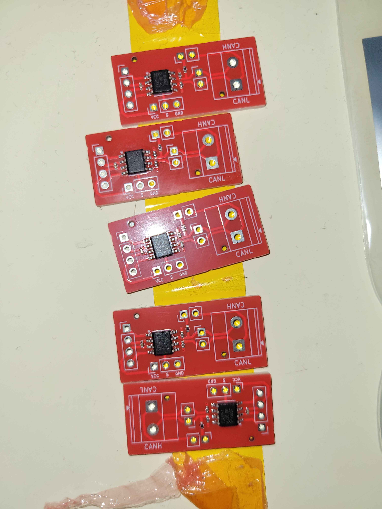
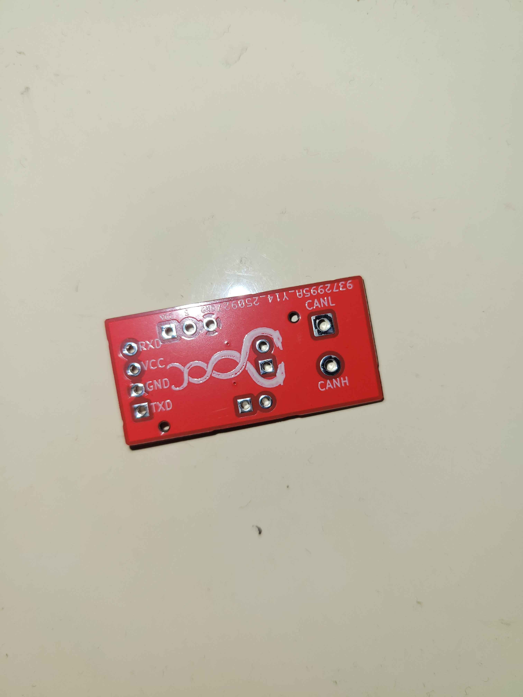
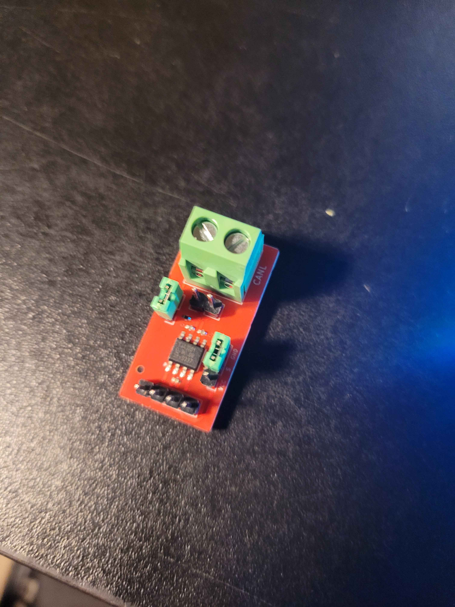
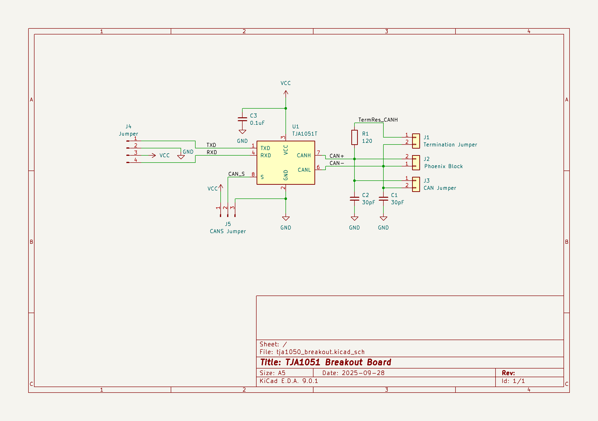

# TJA1051 breakout board

    
    
    

    
    
    

A TJA1051T breakout board featuring a header jumper to enable or disable the termination resistor, an aditional header to pull the S pin high or to GND and a regular pinheader on CAN_H and CAN_L

## Changelog
V1.1
- replaced 0402 components with 0603
- improved silkscreen readability

V1
- initial design